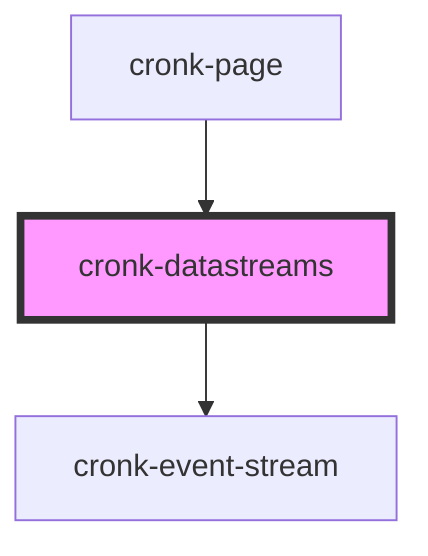

# cronk-datastreams

<!-- Auto Generated Below -->

## Properties

| Property    | Attribute     | Description | Type                    | Default     |
| ----------- | ------------- | ----------- | ----------------------- | ----------- |
| `streams`   | --            |             | `Stream[] \| undefined` | `undefined` |
| `streamsID` | `streams-i-d` |             | `string \| undefined`   | `undefined` |

## Methods

### `getState() => Promise<{ streams: CronkJSONTypes.Stream[] | undefined; pageComponentsReady: boolean; }>`

#### Returns

Type: `Promise<{ streams: Stream[] | undefined; pageComponentsReady: boolean; }>`

### `reload() => Promise<void>`

#### Returns

Type: `Promise<void>`

## Dependencies

### Used by

 - [cronk-page](../cronk-page)

### Depends on

- [cronk-event-stream](../cronk-event-stream)

### Graph

----------------------------------------------

*Built with [StencilJS](https://stenciljs.com/)*
