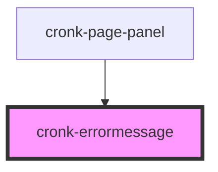

# cronk-errormessage

<!-- Auto Generated Below -->

## Properties

| Property  | Attribute | Description | Type     | Default                      |
| --------- | --------- | ----------- | -------- | ---------------------------- |
| `message` | `message` |             | `string` | `'Yikes! An error occurred'` |

## Dependencies

### Used by

 - [cronk-page-panel](../cronk-page-panel)

### Graph

----------------------------------------------

*Built with [StencilJS](https://stenciljs.com/)*
