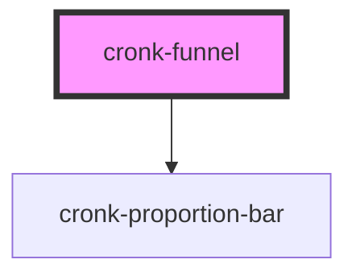

# cronk-funnel

<!-- Auto Generated Below -->

## Properties

| Property      | Attribute      | Description | Type                | Default |
| ------------- | -------------- | ----------- | ------------------- | ------- |
| `hideCount`   | `hide-count`   |             | `boolean`           | `false` |
| `hideLabel`   | `hide-label`   |             | `boolean`           | `false` |
| `hidePercent` | `hide-percent` |             | `boolean`           | `false` |
| `hideStats`   | `hide-stats`   |             | `boolean`           | `false` |
| `statsList`   | --             |             | `IFunnelListItem[]` | `[]`    |

## Dependencies

### Depends on

- [cronk-proportion-bar](../cronk-proportion-bar)

### Graph

----------------------------------------------

*Built with [StencilJS](https://stenciljs.com/)*
