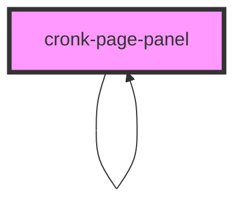

# cronk-page-panel

<!-- Auto Generated Below -->

## Properties

| Property      | Attribute      | Description | Type  | Default     |
| ------------- | -------------- | ----------- | ----- | ----------- |
| `panelConfig` | `panel-config` |             | `any` | `undefined` |

## Dependencies

### Used by

 - [cronk-page-panel]()

### Depends on

- [cronk-errormessage](../cronk-errormessage)
- [cronk-page-components](../cronk-page-components)
- [cronk-page-panel]()

### Graph

----------------------------------------------

*Built with [StencilJS](https://stenciljs.com/)*
