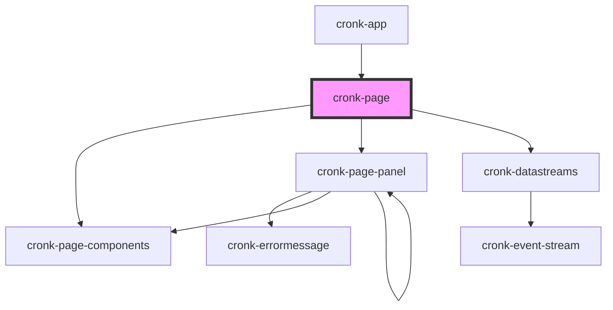

# cronk-page

<!-- Auto Generated Below -->

## Properties

| Property            | Attribute            | Description | Type                                      | Default     |
| ------------------- | -------------------- | ----------- | ----------------------------------------- | ----------- |
| `pageConfig`        | `page-config`        |             | `ReportDefinition or string or undefined` | `undefined` |
| `showConfig`        | `show-config`        |             | `boolean`                                 | `false`     |
| `validationEnabled` | `validation-enabled` |             | `boolean`                                 | `true`      |

## Events

| Event            | Description | Type                |
| ---------------- | ----------- | ------------------- |
| `cronkPageReady` |             | `CustomEvent<void>` |

## Methods

### `loadConfig(newConfig: any) => Promise<void>`

#### Returns

Type: `Promise<void>`

### `validateConfig(configIn: any) => Promise<boolean>`

#### Returns

Type: `Promise<boolean>`

## Dependencies

### Used by

 - [cronk-app](../../views/cronk-app)

### Depends on

- [cronk-page-components](../cronk-page-components)
- [cronk-page-panel](../cronk-page-panel)
- [cronk-datastreams](../cronk-datastreams)

### Graph

----------------------------------------------

*Built with [StencilJS](https://stenciljs.com/)*
