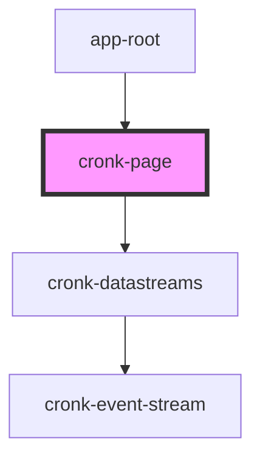

# cronk-page

<!-- Auto Generated Below -->

## Properties

| Property     | Attribute     | Description | Type                            | Default     |
| ------------ | ------------- | ----------- | ------------------------------- | ----------- |
| `pageConfig` | --            |             | `ReportDefinition \| undefined` | `undefined` |
| `showConfig` | `show-config` |             | `boolean`                       | `false`     |

## Events

| Event            | Description | Type                |
| ---------------- | ----------- | ------------------- |
| `cronkPageReady` |             | `CustomEvent<void>` |

## Methods

### `loadConfig(newConfig: any) => Promise<void>`

#### Returns

Type: `Promise<void>`

### `validateConfig(configIn: any) => Promise<boolean>`

#### Returns

Type: `Promise<boolean>`

## Dependencies

### Used by

 - [app-root](../../views/app-root)

### Depends on

- [cronk-datastreams](../cronk-datastreams)

### Graph

----------------------------------------------

*Built with [StencilJS](https://stenciljs.com/)*
