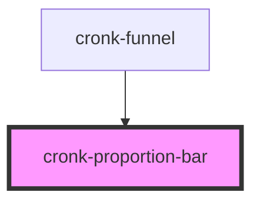

# cronk-proportion-bar

<!-- Auto Generated Below -->

## Properties

| Property | Attribute | Description | Type     | Default     |
| -------- | --------- | ----------- | -------- | ----------- |
| `color`  | `color`   |             | `string` | `'primary'` |
| `value`  | `value`   |             | `number` | `0`         |

## Dependencies

### Used by

 - [cronk-funnel](../cronk-funnel)

### Graph

----------------------------------------------

*Built with [StencilJS](https://stenciljs.com/)*
