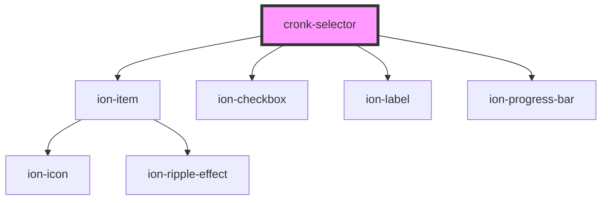

# cronk-selector

<!-- Auto Generated Below -->

## Properties

| Property           | Attribute            | Description | Type                  | Default     |
| ------------------ | -------------------- | ----------- | --------------------- | ----------- |
| `heading`          | `heading`            |             | `string`              | `''`        |
| `label`            | `label`              |             | `string`              | `'COUNT'`   |
| `minimumSelection` | `minimum-selection`  |             | `number`              | `0`         |
| `selectAllOnLoad`  | `select-all-on-load` |             | `boolean`             | `true`      |
| `selectList`       | --                   |             | `ISelectListMember[]` | `[]`        |
| `selector`         | `selector`           |             | `any`                 | `undefined` |

## Dependencies

### Depends on

- ion-item
- ion-checkbox
- ion-label
- ion-progress-bar

### Graph

----------------------------------------------

*Built with [StencilJS](https://stenciljs.com/)*
