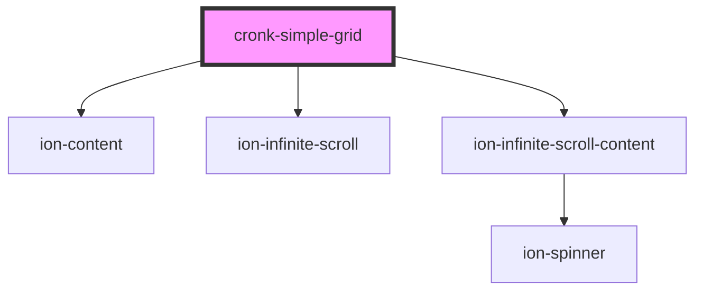

# cronk-simple-grid

<!-- Auto Generated Below -->

## Properties

| Property       | Attribute       | Description | Type                                               | Default  |
| -------------- | --------------- | ----------- | -------------------------------------------------- | -------- |
| `batchSize`    | `batch-size`    |             | `number`                                           | `50`     |
| `data`         | --              |             | `any[]`                                            | `[]`     |
| `display`      | `display`       |             | `"auto" or "grid"`                                 | `'auto'` |
| `headerColour` | `header-colour` |             | `"dark" or "primary" or "secondary" or "tertiary"` | `'dark'` |
| `headers`      | --              |             | `string[]`                                         | `[]`     |
| `rows`         | `rows`          |             | `number`                                           | `10`     |
| `sort`         | --              |             | `[number, string][] or null`                       | `null`   |

## Methods

### `appendItems() => Promise<void>`

#### Returns

Type: `Promise<void>`

## Dependencies

### Depends on

- ion-content
- ion-infinite-scroll
- ion-infinite-scroll-content

### Graph

----------------------------------------------

*Built with [StencilJS](https://stenciljs.com/)*
