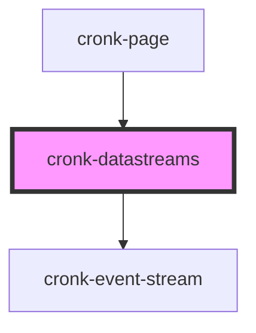

# cronk-datastreams

<!-- Auto Generated Below -->

## Properties

| Property    | Attribute     | Description                   | Type       | Default     |
| ----------- | ------------- | ----------------------------- | ---------- | ----------- |
| `streams`   | --            | Array of stream configuration | `Stream[]` | `undefined` |
| `streamsID` | `streams-i-d` | Unique ID for stream          | `string`   | `undefined` |

## Methods

### `reload() => Promise<void>`

Rebroadcast the last cached payload

#### Returns

Type: `Promise<void>`

## Dependencies

### Used by

 - [cronk-page](../page)

### Depends on

- [cronk-event-stream](../../datastreams/event-stream)

### Graph

----------------------------------------------

*Built with [StencilJS](https://stenciljs.com/)*
