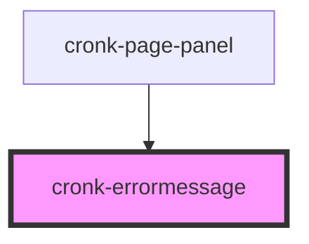

# cronk-errormessage

<!-- Auto Generated Below -->

## Properties

| Property  | Attribute | Description                            | Type     | Default                      |
| --------- | --------- | -------------------------------------- | -------- | ---------------------------- |
| `message` | `message` | Customised message for error reporting | `string` | `'Yikes! An error occurred'` |

## Dependencies

### Used by

 - [cronk-page-panel](../page-panel)

### Graph

----------------------------------------------

*Built with [StencilJS](https://stenciljs.com/)*
