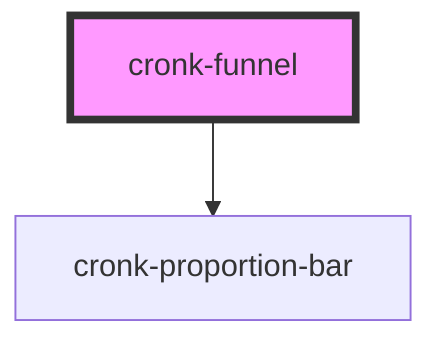

# cronk-funnel

<!-- Auto Generated Below -->

## Properties

| Property      | Attribute      | Description                 | Type               | Default |
| ------------- | -------------- | --------------------------- | ------------------ | ------- |
| `hideCount`   | `hide-count`   | Show/hide count             | `boolean`          | `false` |
| `hideLabel`   | `hide-label`   | Show/hide label             | `boolean`          | `false` |
| `hidePercent` | `hide-percent` | Show/hide percent           | `boolean`          | `false` |
| `hideStats`   | `hide-stats`   | Show/hide stats             | `boolean`          | `false` |
| `statsList`   | --             | {label, count}[] of members | `FunnelListItem[]` | `[]`    |

## Dependencies

### Depends on

- [cronk-proportion-bar](../proportion-bar)

### Graph

----------------------------------------------

*Built with [StencilJS](https://stenciljs.com/)*
