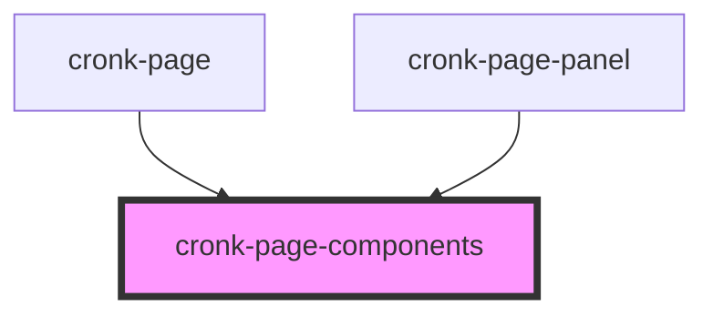

# cronk-page-components

<!-- Auto Generated Below -->

## Events

| Event              | Description                                    | Type                |
| ------------------ | ---------------------------------------------- | ------------------- |
| `componentsLoaded` | Notify whe component has been finally rendered | `CustomEvent<void>` |

## Dependencies

### Used by

 - [cronk-page](../page)
 - [cronk-page-panel](../page-panel)

### Graph

----------------------------------------------

*Built with [StencilJS](https://stenciljs.com/)*
