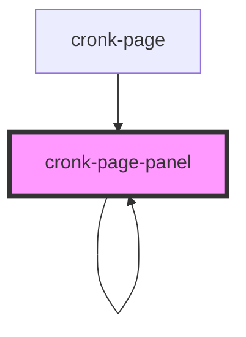

# cronk-page-panel

<!-- Auto Generated Below -->

## Properties

| Property      | Attribute | Description                            | Type              | Default     |
| ------------- | --------- | -------------------------------------- | ----------------- | ----------- |
| `panelConfig` | --        | Configuration for a specific component | `ComponentConfig` | `undefined` |

## Dependencies

### Used by

 - [cronk-page](../page)
 - [cronk-page-panel](.)

### Depends on

- [cronk-errormessage](../errormessage)
- [cronk-page-components](../page-components)
- [cronk-page-panel](.)

### Graph

----------------------------------------------

*Built with [StencilJS](https://stenciljs.com/)*
