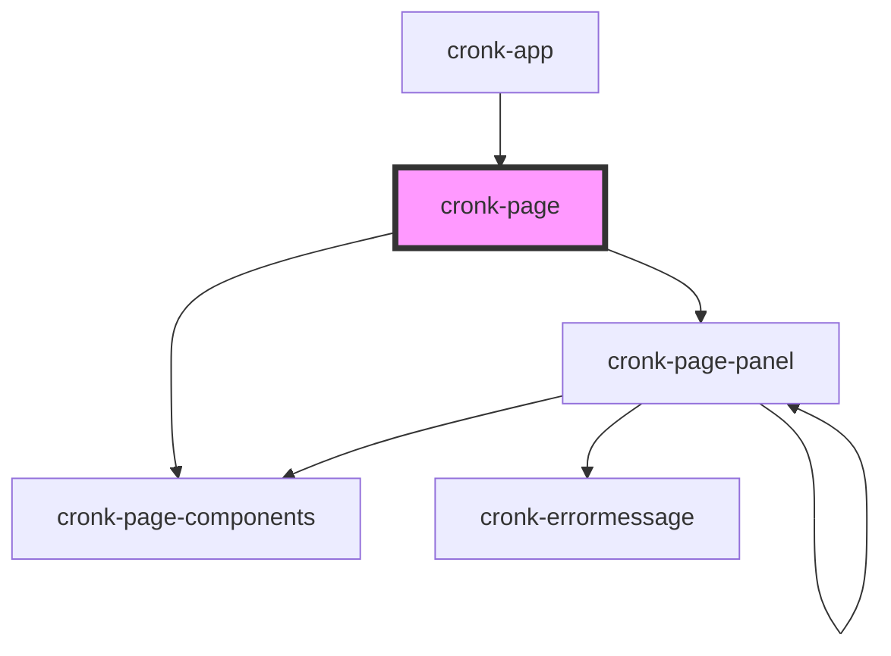

# cronk-page

<!-- Auto Generated Below -->

## Properties

| Property                  | Attribute                   | Description                                            | Type                         | Default     |
| ------------------------- | --------------------------- | ------------------------------------------------------ | ---------------------------- | ----------- |
| `disableSchemaValidation` | `disable-schema-validation` | enable/disable validation ot the cronkite schema       | `boolean`                    | `false`     |
| `pageConfig`              | `page-config`               | Page configuration JSON                                | `ReportDefinition \| string` | `undefined` |
| `showConfig`              | `show-config`               | show or hide the configuration used to render the page | `boolean`                    | `false`     |

## Events

| Event            | Description                                                                                                                                                      | Type                |
| ---------------- | ---------------------------------------------------------------------------------------------------------------------------------------------------------------- | ------------------- |
| `cronkPageReady` | broadcast to any listener (mostly datastreams) that the page has fully rendered and payloads should be rebroadcast to ensure the lated data is set on components | `CustomEvent<void>` |

## Methods

### `loadConfig(newConfig: ReportDefinition | string) => Promise<void>`

Load new page configuration JSON

#### Returns

Type: `Promise<void>`

### `validateConfig(configIn: unknown) => Promise<boolean>`

validate provided configuration JSON for a page

#### Returns

Type: `Promise<boolean>`

## Dependencies

### Used by

 - [cronk-app](../../views/cronk-app)

### Depends on

- [cronk-page-components](../page-components)
- [cronk-page-panel](../page-panel)

### Graph

----------------------------------------------

*Built with [StencilJS](https://stenciljs.com/)*
