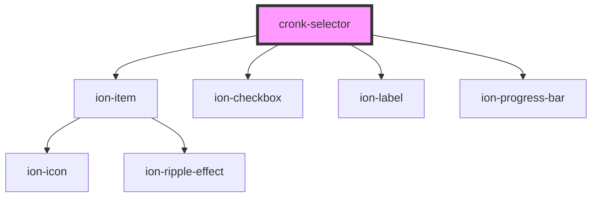

# cronk-selector

<!-- Auto Generated Below -->

## Properties

| Property           | Attribute            | Description                                                 | Type                 | Default     |
| ------------------ | -------------------- | ----------------------------------------------------------- | -------------------- | ----------- |
| `heading`          | `heading`            | Custom heading for the selector                             | `string`             | `''`        |
| `label`            | `label`              | Label for each selectable - default 'COUNT'                 | `string`             | `'COUNT'`   |
| `minimumSelection` | `minimum-selection`  | Minimum number of selected members                          | `number`             | `0`         |
| `selectAllOnLoad`  | `select-all-on-load` | Should all selectable members be selected on initial render | `boolean`            | `true`      |
| `selectList`       | --                   | a list of selectable members {select, label, count}[]       | `SelectListMember[]` | `[]`        |
| `selector`         | `selector`           | a value that will be used to filter data streams by         | `any`                | `undefined` |

## Dependencies

### Depends on

- ion-item
- ion-checkbox
- ion-label
- ion-progress-bar

### Graph

----------------------------------------------

*Built with [StencilJS](https://stenciljs.com/)*
