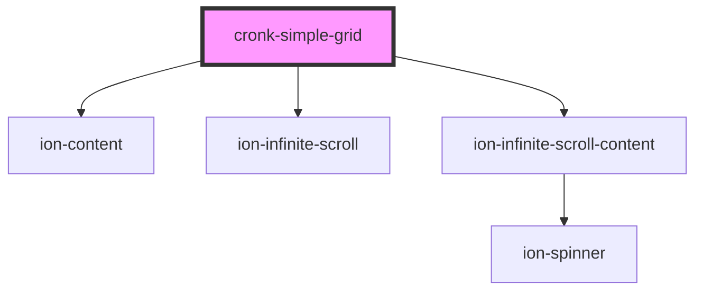

# cronk-simple-grid

<!-- Auto Generated Below -->

## Properties

| Property       | Attribute       | Description                                                        | Type                                               | Default  |
| -------------- | --------------- | ------------------------------------------------------------------ | -------------------------------------------------- | -------- |
| `batchSize`    | `batch-size`    | How many new elements to attach to grid when the bottom is reached | `number`                                           | `50`     |
| `data`         | --              | any[][] for data to be rendered in the table                       | `any[]`                                            | `[]`     |
| `display`      | `display`       | CSS display property                                               | `"auto" \| "grid"`                                 | `'auto'` |
| `headerColour` | `header-colour` | Style settings for grid header row                                 | `"dark" \| "primary" \| "secondary" \| "tertiary"` | `'dark'` |
| `headers`      | --              | string[] of table headers                                          | `string[]`                                         | `[]`     |
| `rows`         | `rows`          | How many rows to render before scroll overflow kicks in            | `number`                                           | `10`     |
| `sort`         | --              | How to sort columns                                                | `[number, string][]`                               | `null`   |

## Methods

### `appendItems() => Promise<void>`

Append items to the grid

#### Returns

Type: `Promise<void>`

## Dependencies

### Depends on

- ion-content
- ion-infinite-scroll
- ion-infinite-scroll-content

### Graph

----------------------------------------------

*Built with [StencilJS](https://stenciljs.com/)*
