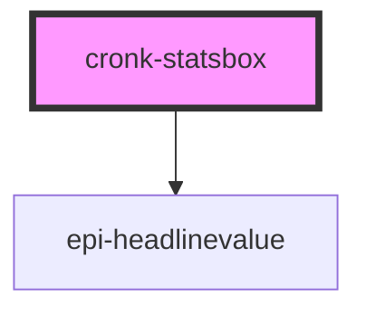

# cronk-statsbox

<!-- Auto Generated Below -->

## Properties

| Property    | Attribute | Description                                                              | Type                 | Default |
| ----------- | --------- | ------------------------------------------------------------------------ | -------------------- | ------- |
| `statsList` | --        | Array of {label: string, value: JSONValue} for stats box headline values | `StatsBoxListItem[]` | `[]`    |

## Dependencies

### Depends on

- epi-headlinevalue

### Graph

----------------------------------------------

*Built with [StencilJS](https://stenciljs.com/)*
