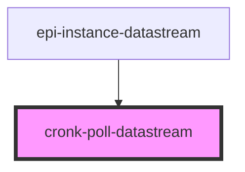

# cronk-poll-datastream

<!-- Auto Generated Below -->

## Properties

| Property          | Attribute         | Description | Type                                                                | Default                                                                                                                                                                                                                                                                                                                                                                                                                                                                                                                                                                                                                                                                                                                                                                                                                                                                                                                                                                                                             |
| ----------------- | ----------------- | ----------- | ------------------------------------------------------------------- | ------------------------------------------------------------------------------------------------------------------------------------------------------------------------------------------------------------------------------------------------------------------------------------------------------------------------------------------------------------------------------------------------------------------------------------------------------------------------------------------------------------------------------------------------------------------------------------------------------------------------------------------------------------------------------------------------------------------------------------------------------------------------------------------------------------------------------------------------------------------------------------------------------------------------------------------------------------------------------------------------------------------- |
| `acceptsFilters`  | `accepts-filters` |             | `boolean`                                                           | `false`                                                                                                                                                                                                                                                                                                                                                                                                                                                                                                                                                                                                                                                                                                                                                                                                                                                                                                                                                                                                             |
| `channels`        | --                |             | `IChannelShape[]`                                                   | `DEFAULT_CHANNELS`                                                                                                                                                                                                                                                                                                                                                                                                                                                                                                                                                                                                                                                                                                                                                                                                                                                                                                                                                                                                  |
| `corsProxy`       | `cors-proxy`      |             | `string`                                                            | `''`                                                                                                                                                                                                                                                                                                                                                                                                                                                                                                                                                                                                                                                                                                                                                                                                                                                                                                                                                                                                                |
| `credentials`     | `credentials`     |             | `"include" \| "omit" \| "same-origin"`                              | `'include'`                                                                                                                                                                                                                                                                                                                                                                                                                                                                                                                                                                                                                                                                                                                                                                                                                                                                                                                                                                                                         |
| `mode`            | `mode`            |             | `"cors" \| "navigate" \| "no-cors" \| "same-origin"`                | `'cors'`                                                                                                                                                                                                                                                                                                                                                                                                                                                                                                                                                                                                                                                                                                                                                                                                                                                                                                                                                                                                            |
| `pollFrequency`   | `poll-frequency`  |             | `number`                                                            | `15000`                                                                                                                                                                                                                                                                                                                                                                                                                                                                                                                                                                                                                                                                                                                                                                                                                                                                                                                                                                                                             |
| `responseHandler` | --                |             | `(data: IMetadataObj, streamState: IStreamConfig) => Promise<void>` | `async (     data: any,     streamState: CronkDataStream.IStreamConfig,   ) => {     const { channels, dispatch, filters } = streamState;     let filteredData: any;      channels.forEach(async c => {       filteredData = await processValue(data, c.shape \|\| DEFAULT_SHAPE);       const canFilter = c.filtered !== undefined ? c.filtered : true;       if (canFilter && filters.length && Array.isArray(filteredData)) {         filteredData = filteredData.filter((datum: CronkDataStream.IMetadataObj) =>           filters.map(filter => filter(datum)).every(i => i),         );       }       const dispatchFn = (_channel: string, _hostEl: HTMLElement, _filteredData: any) => async () => {         console.debug(`%cEPI-POLL-DATASTREAM::dispatch::${_channel}`, 'color: violet');         dispatch(_channel, _hostEl, _filteredData);       };       this.cachedBroadcasts[c.channel] = dispatchFn(c.channel, this.hostEl, filteredData);       this.cachedBroadcasts[c.channel]();     });   }` |
| `type`            | `type`            |             | `string`                                                            | `'data'`                                                                                                                                                                                                                                                                                                                                                                                                                                                                                                                                                                                                                                                                                                                                                                                                                                                                                                                                                                                                            |
| `url`             | `url`             |             | `null \| string`                                                    | `null`                                                                                                                                                                                                                                                                                                                                                                                                                                                                                                                                                                                                                                                                                                                                                                                                                                                                                                                                                                                                              |

## Methods

### `addFilter(fnKey: string, filterFn: () => boolean) => Promise<void>`

#### Returns

Type: `Promise<void>`

### `listFilters() => Promise<{}>`

#### Returns

Type: `Promise<{}>`

### `resendBroadcast() => Promise<void>`

#### Returns

Type: `Promise<void>`

## Dependencies

### Used by

 - [epi-instance-datastream](../epi-instance-datastream)

### Graph

----------------------------------------------

*Built with [StencilJS](https://stenciljs.com/)*
