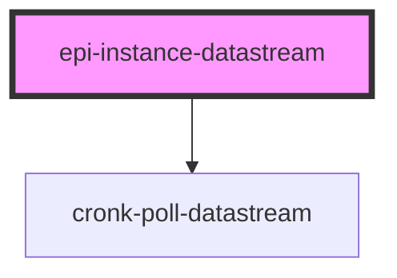

# epi-instance-datastream

<!-- Auto Generated Below -->

## Properties

| Property                          | Attribute              | Description | Type                                                 | Default              |
| --------------------------------- | ---------------------- | ----------- | ---------------------------------------------------- | -------------------- |
| `channel`                         | `channel`              |             | `string`                                             | `'instance:default'` |
| `credentials`                     | `credentials`          |             | `"include" \| "omit" \| "same-origin"`               | `'include'`          |
| `flavour` _(required)_            | `flavour`              |             | `string`                                             | `undefined`          |
| `idWorkflowInstance` _(required)_ | `id-workflow-instance` |             | `number \| string`                                   | `undefined`          |
| `mode`                            | `mode`                 |             | `"cors" \| "navigate" \| "no-cors" \| "same-origin"` | `'cors'`             |
| `pollFrequency`                   | `poll-frequency`       |             | `number`                                             | `15000`              |
| `type`                            | `type`                 |             | `string`                                             | `'default'`          |

## Dependencies

### Depends on

- [cronk-poll-datastream](../cronk-poll-datastream)

### Graph

----------------------------------------------

*Built with [StencilJS](https://stenciljs.com/)*
