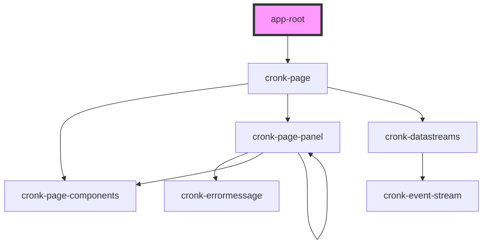

# app-root

<!-- Auto Generated Below -->

## Properties

| Property | Attribute | Description | Type     | Default         |
| -------- | --------- | ----------- | -------- | --------------- |
| `report` | `report`  |             | `string` | `'hello-world'` |

## Dependencies

### Depends on

- [cronk-page](../../components/cronk-page)

### Graph

----------------------------------------------

*Built with [StencilJS](https://stenciljs.com/)*
