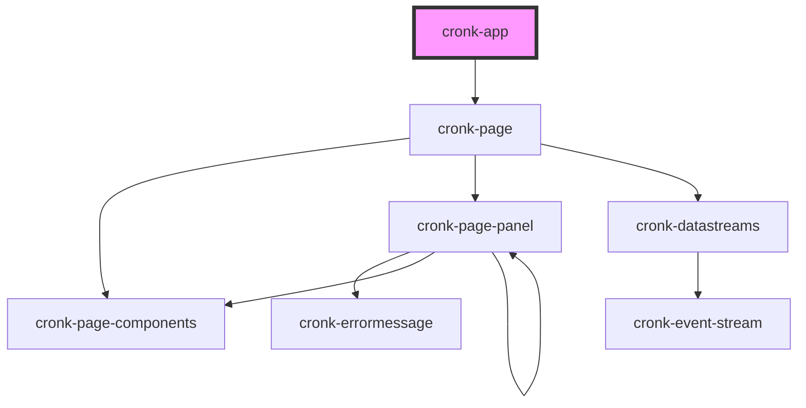

# cronk-app

<!-- Auto Generated Below -->

## Properties

| Property | Attribute | Description       | Type     | Default         |
| -------- | --------- | ----------------- | -------- | --------------- |
| `report` | `report`  | Example file name | `string` | `'hello-world'` |

## Dependencies

### Depends on

- [cronk-page](../../components/page)

### Graph

----------------------------------------------

*Built with [StencilJS](https://stenciljs.com/)*
